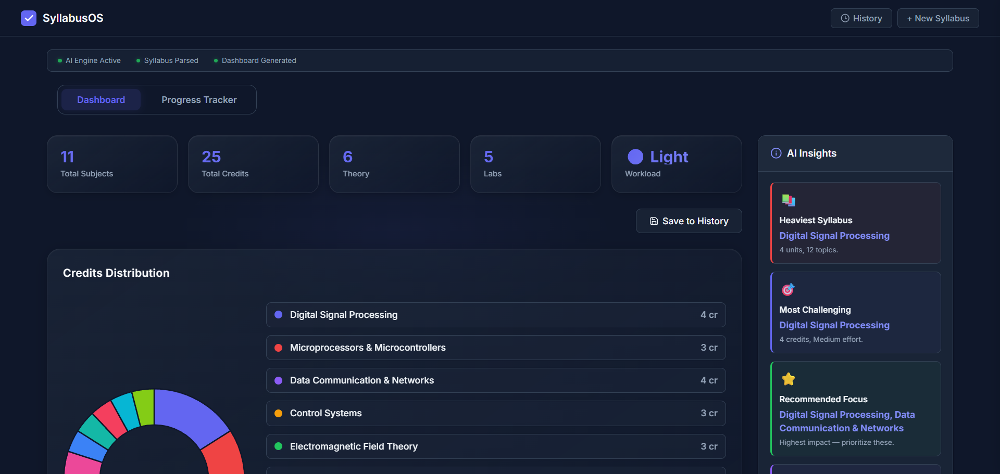

# SyllabusOS 🚀
**The Ultimate AI-Powered Academic Command Center**



SyllabusOS transforms chaotic course documents into a structured, trackable academic roadmap. Built for the modern student, it combines blazing-fast AI inference with a stunning, high-density dashboard.

---

## ✨ Features

- **⚡ Blazing Fast AI Parsing**: Instantly extract modules, topics, and credits using Groq's high-speed Llama 3 models.
- **🍱 Bento Grid Dashboard**: A premium, "spatial" glassmorphic interface for a complete bird's-eye view of your semester.
- **🔐 Secure Auth & Sync**: Powered by Supabase, featuring seamless **Google OAuth** and per-user secure storage.
- **🔄 Smooth Migration**: Automatically migrates anonymous syllabus data to your account upon first login.
- **📊 Adaptive Tracker**: Mark off topics as you study; watch progress rings update and study times recalculate in real-time.
- **🛤️ Chronological Rail**: A horizontally scrolling timeline of your academic deliverables.

---

## 🚀 Quick Start (Demo Ready)

1. **Clone & Install**:
   ```bash
   git clone https://github.com/your-username/SyllabusOS.git
   cd SyllabusOS
   npm install
   ```

2. **Configure Environment**:
   Copy `.env.example` to `.env` and add your keys for **Groq Cloud** and **Supabase**.

3. **Launch**:
   ```bash
   npm run start
   ```

---

## 🧪 Experience the Flow (Judges' Checklist)

Follow these steps to experience the full power of SyllabusOS:

1. **Pasted Power**: Go to the landing page and paste a syllabus from the [TEST_SUITE.md](TEST_SUITE.md).
2. **Anonymous-to-Auth**: Generate the dashboard, then click the **Profile Logo** (top right) to sign up via Google or Email.
3. **The Magic**: Watch your anonymous data automatically sync to your new authenticated profile.
4. **Interact**: Toggle topics in the dashboard, scroll the timeline, and check the "Estimated Study Time" recalculate.

---

## 📚 Documentation
- [TEST_SUITE.md](TEST_SUITE.md): Sample syllabi for judges and testing instructions.
- [HACKATHON_JUDGES.md](HACKATHON_JUDGES.md): Technical deep-dive and architectural release notes.

---

## 🛠️ Tech Stack
- **Frontend**: ES Modules, Vanilla JS, CSS Grid/Flexbox
- **Backend**: Node.js & Express
- **Auth & Database**: Supabase (RLS Enabled)
- **AI Engine**: Groq Cloud (Llama 3 8B)
- **Deployment**: Vercel

---

_Built with ❤️ for perfectly organized semesters._
